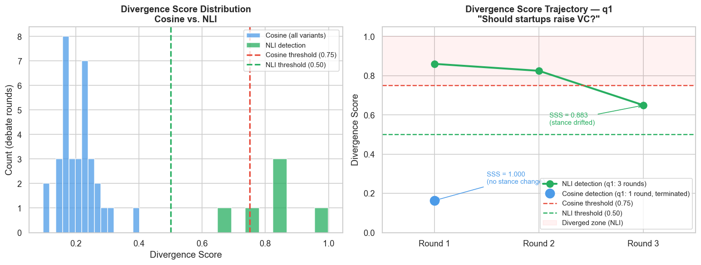

# 多智能体辩论系统

[](https://github.com/xyma2003/multi-agent-debate/actions/workflows/ci.yml)
[](https://www.python.org/)
[](LICENSE)

[English](README.md)

这是一个基于 LangGraph 的个人作品集项目。三个采用不同分析方法的 LLM Agent——乐观分析者、风险分析者和框架挑战者——先独立分析问题，再进行有上限的多轮反驳，记录带归因的让步，并生成可追溯报告。

正式应用默认使用 NLI 矛盾检测决定是否进入下一轮。轻量的余弦模式仍作为对照保留，但不应被视为可靠的立场检测器。

## 项目展示的能力

- LangGraph 并行 fan-out/fan-in 与有界循环编排
- Pydantic 结构化输出及解析失败降级
- 基于 NLI 的矛盾检测与调用方轮数上限
- 公式计算的置信度和带来源的让步记录
- SQLite 持久化、Streamlit 回放与可选 LangSmith 追踪
- 面向提示词和路由策略消融的实验流水线

## 系统流程

```text
问题
  └─► 初始化
       └─► 乐观分析者 ─┐
           风险分析者   ├─► 汇总 ─► 分歧检测
           框架挑战者 ─┘                  │
                   ┌─ 无矛盾/达到上限 ─► 综合报告 ─► 保存
                   └─ 检测到矛盾 ─► 下一轮反驳 ─┘
```

最终 `DebateReport` 包含共识点、争议点、结论、公式生成的置信度、完整轮次轨迹，以及每次让步对应的触发 Agent 和具体论点。



该图是历史探索性可视化；解读前请一并阅读下文的证据级别与数据来源说明。

## 快速开始

需要 Python 3.10+，以及任一受支持的 LLM API 密钥。

```bash
git clone https://github.com/xyma2003/multi-agent-debate.git
cd multi-agent-debate

python3 -m venv .venv
source .venv/bin/activate          # Windows: .venv\Scripts\activate
pip install -r requirements.txt

cp .env.example .env
streamlit run app.py
```

浏览器访问 <http://localhost:8501>。

默认 NLI 模式首次运行会下载 `cross-encoder/nli-deberta-v3-small`（约 180 MB）。可选的余弦对照模式会下载 `BAAI/bge-small-en-v1.5`（约 130 MB）。

### 配置示例

`.env.example` 包含全部后端配置。SiliconFlow/OpenAI-compatible 的最小配置如下：

```dotenv
LLM_BACKEND=openai
OPENAI_API_KEY=sk-...
OPENAI_API_BASE=https://api.siliconflow.cn/v1
OPENAI_MODEL=Qwen/Qwen3-32B
DIVERGENCE_MODE=nli
```

支持 `openai`、`anthropic`、`groq`、`qwen`、`cerebras`、`together`、`sambanova` 和 `gemini`。

## 关键设计

| 设计 | 原因 |
|---|---|
| 方法论角色 | Agent 获得可执行的分析流程，而不只是性格标签 |
| 默认 NLI 路由 | 检测逻辑矛盾，而非共享词汇带来的话题相似性 |
| 检测器自行判断分歧对 | 避免用同一阈值比较余弦距离与 NLI 概率 |
| 用户轮数上限 + 绝对安全上限 | 遵守 `max_rounds`，同时防止无限循环 |
| 公式生成置信度 | 分数可检查，不由 LLM 临时编造 |
| 让步归因 | 记录哪个论点改变了哪个立场及其原因 |

## 测试

```bash
pip install -r requirements-dev.txt

# CI 使用的确定性测试；不下载模型、不调用 API
python -m pytest -m "not integration and not model and not ui" -q

# 以下按需运行
python -m pytest -m model -v        # 下载本地嵌入/NLI模型
python -m pytest -m integration -v  # 需要 API 凭据
python -m pytest -m ui -v           # Streamlit UI 测试
```

## 实验结论应如何理解

仓库中的实验用于工程探索，不是发表级研究证据。样本量较小，多数问题只运行一次，部分质量评测依赖单一 LLM judge。

干净的基础对比每个系统包含 10 个问题：

| 系统 | n | PDS ↑ | 对冲率 ↓ | 平均轮数 |
|---|---:|---:|---:|---:|
| 修正后的框架挑战者 | 10 | 0.2242 | 0.0093 | 1.00 |
| 单 LLM 基线 | 10 | 0.2160 | 0.0129 | 1.00 |
| 旧版挑战者提示词 | 10 | 0.1707 | 0.0077 | 1.00 |

在这组样本中，修正后的提示词获得了高于旧提示词的 PDS；多 Agent 输出的平均对冲率比单 LLM 基线低约 28%。这些是本次样本中的观察值，不代表已经证明了可泛化的因果提升。

另一组规范化 NLI 运行包含 7 个问题：4/7 进入多轮，平均轮数为 2.14，平均立场稳定性为 0.977。数据来源、验证失败和统计口径详见 [`results/README.md`](results/README.md)。

重新运行实验：

```bash
python benchmark/run_experiment.py \
  --variants full_system single_llm nli_detection \
  --limit 10 --max-rounds 3 --delay 30
```

模型实验需要下载、凭据、时间和费用，因此不放入 CI。
benchmark 会显式固定各变体的检测器，因此即使生产应用默认 NLI，余弦基线与 NLI 消融仍保持不同语义。

## 已知局限

- 问题集规模较小且非随机抽样，多数变体每题只有一次运行
- LLM-as-judge 会受到 judge 模型和评分规则影响
- 余弦模式只能衡量语义接近程度，不能可靠判断立场对立
- NLI 增加本地模型下载和推理成本
- 置信度是透明的启发式指标，不是经过校准的正确率概率
- 强制立场可能同时压制空洞对冲和合理的不确定性表达

## 项目结构

```text
app.py                         Streamlit 界面
debate/                        图、数据模型、提示词、路由、持久化
benchmark/                     实验运行器、变体和评测器
results/                       原始输出与数据口径说明
analysis/                      notebook 与实验图
tests/                         确定性、模型、UI 和集成测试
.github/workflows/ci.yml       确定性 CI
PAPER.md                       探索性研究风格报告
BLOG_EN.md / BLOG_ZH.md        工程复盘长文
```

## 简历描述

> 基于 LangGraph 设计多智能体辩论系统，通过并行角色编排、结构化输出、NLI 分歧路由与让步归因生成可追溯报告；构建面向提示词和终止策略的消融评测流水线。

## 项目状态

主体开发与实验阶段：**2026 年 4–6 月**。后续提交主要为维护、模型后端兼容和可观测性补充。项目已进入功能冻结与稳定维护阶段。

MIT License。
